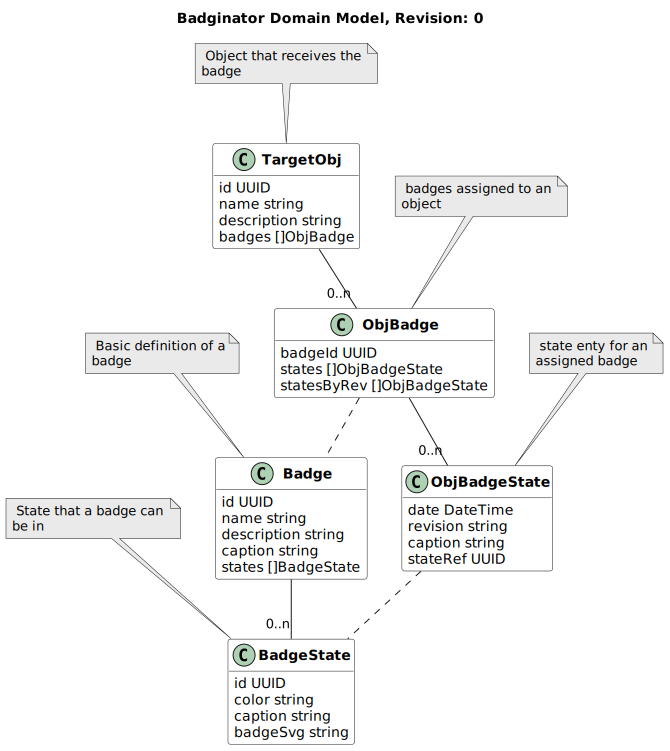

# The Badginator

In the future a tool to deliver SVG badges

# Usage

... w.i.p.

# Building

**Attention** This tool is using the native sqlite driver,
`CGO_ENABLED=1` needs to be set.
If you start the program for the first time or you build it,
then the execution time is really slow - stay patient!

# Model behind the application

# Logo
Special thanks to the sponsor of the nice logo: https://github.com/plathub
